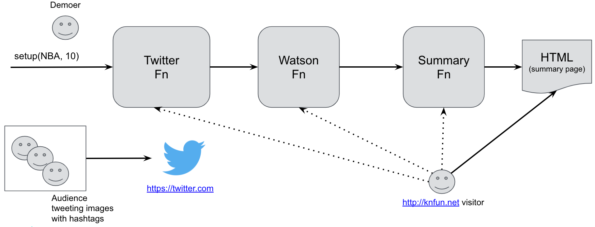

# knfun

Knfun is a set of Knative micro-services / micro-functions intended to be used for live demos. The main goal is to illustrate the end-to-end developer experience of using [Knative](https://knative.dev) and its `kn` CLI.

The first demo uses three functions in a live demo setting (ideally with an audience participating). The following diagram is a sketch of this demo and these [slides](docs/demo1-slides.pdf) can be used for introduction.



## Functions

1. *TwitterFn* search function (via [Twitter's API](https://developer.twitter.com/en/docs))
	* _in_: hashtags or string to search
	* _in_: count (max number of tweets)
	* _out_: recent tweets with images

2. *WatsonFn* visual recognition image classifier function (via IBM's [Watson APIs](https://cloud.ibm.com/apidocs/visual-recognition/visual-recognition-v3))
	* _in_: image URL
	* _out_: image features (class) with confidence (score)

3. *SummaryFn* function
	* _in_: search string and twitterFn and WatsonFn URLs
	* _in_: count (max number of tweets)
	* _out_: HTML page displaying summary

Of course, both the *TwitterFn* and *WatsonFn* require credentials to execute. This means that the keys for both the *TwitterFn* and *WatsonFn* are also required as input, however, to simplify the discussion, they are somtimes ommited in diagram and some other places.

Table of Contents
=================

  * [Introduction](#knfun)
  * [Setup](#setup)
  	* [Credentials](#credentials)
		* [Twitter](#twitter)
		* [Watson](#watson)
  * [Build](#build)
  * [Test](#test)
  	* [twitter-fn](#twitter-fn)
	* [watson-fn](#watson-fn)
	* [summary-fn](#summary-fn)
	* [Credentials Config](#credentials-config)
	* [e2e](#e2e)
  * [Deploy](#deploy)
  * [Run](#run)

# Setup

This repository is self-contained except for the following dependencies which you should have met before getting started.

1. Go version go1.12.x or later. Go to [Golang download](https://golang.org/dl/) page to get the version for your OS.
2. [Docker engine](https://docs.docker.com/engine/installation/) for your machine. Specifically ensure you can execute the `docker` executable at the command line.
3. [Knative](https://knative.dev/) cluster. Depending on your Kubernetes cluster provider you can find different means for [getting Knative installed](https://knative.dev/docs/install/) onto your cluster.
4. [Knative's `kn` client](https://github.com/knative/client). Once you have your Knative cluster, follow the steps to build `kn` or get one from the released builds.

Once these four dependencies are met, continue below with steps to get and set your APIs credentials, build, test, and deploy the functions for the demos.

## Credentials

As mentioned above, you need to get credentials for both the [Twitter API](https://developer.twitter.com/en/docs) and the [IBM Watson API](https://cloud.ibm.com/apidocs/visual-recognition/visual-recognition-v3). Once you do, then you should be able to follow the steps below. 

To facilitate using and passing these secrets in the commands, I recommend setting environment variables for each string in your shell. Feel free to use other means but in the description below I am assuming that the secret values are set to the environment variables correspondingly named.

### Twitter

Once you have access to the [Twitter API](https://developer.twitter.com/en/docs), you will have four different keys (as strings). They are:

1. Twitter API Key - TWITTER_API_KEY
2. Twitter API Secret Key - TWITTER_API_SECRET_KEY
3. Twitter Access Token - TWITTER_ACCESS_TOKEN
4. Twitter Access Token Secret - TWITTER_ACCESS_TOKEN_SECRET

To set these on your shell, do the following replacing the content in `<>` with your key value

```bash
export TWITTER_API_KEY=<your Twitter API key value here>
export TWITTER_API_SECRET_KEY=<your Twitter API secret key value here>
export TWITTER_ACCESS_TOKEN=<your Twitter access token value here>
export TWITTER_ACCESS_TOKEN_SECRET=<your Twitter access token secret value here>
```

### Watson

Access to the IBM Watson API requires one secret and two constant values. They are:

1. Watson API Key - WATSON_API_KEY
2. Watson API URL - WATSON_API_URL
3. Watson APU Version - WATSON_API_VERSION

```bash
export WATSON_API_KEY=<your Watson API key value here>
export WATSON_API_URL=https://gateway.watsonplatform.net/visual-recognition/api
export WATSON_API_VERSION=2018-03-19
```

# Build

After cloning this repository. You can build all functions with the following command:

```bash
./hack/build.sh
🕸️  Update
🧽  Format
⚖️  License
📖 Docs
🚧 Compile
────────────────────────────────────────────
success
```

The result is that you should now have three executables: `twitter-fn`, `watson-fn`, and `summary-fun`. 

```bash
ls
LICENSE    docs       go.mod     hack       twitter-fn watson-fn
README.md  funcs      go.sum     summary-fn vendor
```

These are designed as both CLIs and server functions that you can test locally and deploy on Knative.

# Test

Let's first explore how to test the functions locally. Later we will show how you can run [e2e](#e2e) tests automatically for quick sanity checks.

## twitter-fn

For each function you can run them locally as a CLI to get immediate response. You can also run them as a local server and use your browser to see the responses changing input. For example, the following will display recent tweets that have the word `NBA`

```bash
./twitter-fn search NBA -c 20 -o text \
			 --twitter-api-key $TWITTER_API_KEY \
			 --twitter-api-secret-key $TWITTER_API_SECRET_KEY \
			 --twitter-access-token $TWITTER_ACCESS_TOKEN \
			 --twitter-access-token-secret $TWITTER_ACCESS_TOKEN_SECRET \
```

To run this function as a server and see JSON output on your browser or with curl, do the following:

```bash
./twitter-fn search NBA -c 20 -o json -S -p 8080 \
			 --twitter-api-key $TWITTER_API_KEY \
			 --twitter-api-secret-key $TWITTER_API_SECRET_KEY \
			 --twitter-access-token $TWITTER_ACCESS_TOKEN \
			 --twitter-access-token-secret $TWITTER_ACCESS_TOKEN_SECRET \
```

Then open your browser at `http://localhost:8080` or do `curl http://localhost:8080`. 

To see what other options are available for the `twitter-fn` `search` function get the CLI help with: `./twitter-fn search --help`

## watson-fn

Similarly for the `watson-fn` function you can test it locally with any image for which you have a public URL with the following.

```bash
./watson-fn vr classify https://upload.wikimedia.org/wikipedia/commons/c/c3/Jordan_by_Lipofsky_16577.jpg -o text \
			   --watson-api-key $WATSON_API_KEY \
			   --watson-api-url $WATSON_API_URL \
			   --watson-api-version $WATSON_API_VERSION \
```

To run this as a server and see JSON output on your browser or with curl, do the following:

```bash
./watson-fn vr classify https://upload.wikimedia.org/wikipedia/commons/c/c3/Jordan_by_Lipofsky_16577.jpg -o json -p 8081 \
			   --watson-api-key $WATSON_API_KEY \
			   --watson-api-url $WATSON_API_URL \
			   --watson-api-version $WATSON_API_VERSION \
```

You can change the input at the browser by passing the URL with the `q` or `query` URL paramter. For example: `http://localhjost:8081?http://pbs.twimg.com/media/EHpWVAvWoAEfVzO.jpg&o=json`. If you can the `o` to `text` then the image classification will display as text.

## summary-fn

Finally, you can test the `summary-fn` function locally after running the `twitter-fn` and `watson-fn` as servers. For instance, if they are running respectively at ports `8080` and `8081`, use the following to run the `summary-fn`.

```bash
./summary-fn NBA -o text -c 10 -o text \
 	     --twitter-fn-url http://localhost:8080 \
	     --watson-fn-url http://localhost:8081 \
```

To run `summary-fn` as a server and see output on your browser or with curl, do the following:

```bash
./summary-fn NBA -o text -c 10 -o text -S -p 8082 \
             --twitter-fn-url http://localhost:8080 \
             --watson-fn-url http://localhost:8081 \
```

Open your browser at `http://localhost:8082` or `curl http://localhost:8082`

## Credentials config

You can avoid passing all the credentials everytime by creating a file named `.knfun.yaml` in your home directory and adding the credential values in it. The following command will create that file and set the values from the environment variables we discussed above.

```bash
touch ~/.knfun.yaml
cat <<EOF >> ~/.knfun.yaml
twitter-api-key: $TWITTER_API_KEY
twitter-api-secret-key: $TWITTER_API_SECRET_KEY
twitter-access-token: $TWITTER_ACCESS_TOKEN
twitter-access-token-secret: $TWITTER_ACCESS_TOKEN_SECRET

# watson-fn
watson-api-key: $WATSON_API_KEY
watson-api-url: https://gateway.watsonplatform.net/visual-recognition/api
watson-api-version: 2018-03-19
EOF
```

Once this config `.knfun.yaml` is present in your home directory, execution of the `twitter-fn` and `watson-fn` will pick up the key values automatically. So instead of invoking:

```bash
./watson-fn vr classify http://pbs.twimg.com/media/EHpWVAvWoAEfVzO.jpg -o json \
						--watson-api-key $WATSON_API_KEY \
						--watson-api-url $WATSON_API_URL \
						--watson-api-version $WATSON_API_VERSION \
```

You can simply do:

```bash
./watson-fn vr classify http://pbs.twimg.com/media/EHpWVAvWoAEfVzO.jpg -o json
```

## e2e

You can easily run end-to-end (e2e) tests once you have configured your credentials in a `~/.knfun.yaml` by invoking the `./test/e2e-tests-local.sh`. 

```bash
./test/e2e-tests-local.sh
📋 Formatting
🧪  Testing
=== RUN   TestSmoke
=== PAUSE TestSmoke
=== CONT  TestSmoke
=== RUN   TestSmoke/verifies_twitter-fn_search
Running 'twitter-fn search NBA -c 10 -o json'...
=== RUN   TestSmoke/verifies_watson-fn_vr_classify
Running 'watson-fn vr classify http://pbs.twimg.com/media/EHb34-KXYAESI46.jpg -o json'...
--- PASS: TestSmoke (3.88s)
    --- PASS: TestSmoke/verifies_twitter-fn_search (0.53s)
    --- PASS: TestSmoke/verifies_watson-fn_vr_classify (3.35s)
...
PASS
ok  	github.com/maximilien/knfun/test/e2e	4.052s
```

To run a quick "smoke" test that verifies each function then run the `./hack/build.sh --test`. It will display any errors and place output content in a file named `/tmp/knfun-test-output.XXXXXX`.

```bash
./hack/build.sh --test
🧪  Tests
  🧪 e2e
```

# Deploy

In order to deploy into a Knative cluster, you must first create images and publish them into a repository. We will be using Docker for that purpose. The `./hack/build.sh --docker-images` and `./hack/build.sh --docker-push` will respectively create Docker images and push them in your [Docker Hub](https://docker.io) account for you. You simply need to make sure the `docker` executable is visible to your shell and that the environment variable `DOCKER_USERNAME` is set to your Docker Hub user ID.

```bash
./hack/build.sh --docker-images
🚧 🐳 build images
   🚧 🐳 twitter-fn
Sending build context to Docker daemon  55.42MB
...
...
Successfully tagged drmax/twitter-fn:latest
   🚧 🐳 watson-fn
...
Successfully tagged drmax/watson-fn:latest
   🚧 🐳 summary-fn
...
Successfully tagged drmax/summary-fn:latest
```

And when publishing the images.

```bash
./hack/build.sh --docker-push
🐳 push images
   🐳 twitter-fn
The push refers to repository [docker.io/drmax/twitter-fn]
...
   🐳 watson-fn
The push refers to repository [docker.io/drmax/watson-fn]
...
   🐳 summary-fn
...
```

Your images should not be avaible at:

1. `docker.io/${DOCKER_USERNAME}/twitter-fn`
2. `docker.io/${DOCKER_USERNAME}/watson-fn`
3. `docker.io/${DOCKER_USERNAME}/summary-fn`

You can use these images to deploy them into your Knative cluster with the `kn` CLI.

# Run

Deploying into Knative means you have a Knative cluster ready and your `$KUBECONFIG` is set or that the `~/.kube/config` file is pointing to the cluster's Kubernetes configuration file.

## Twitter

```bash
./kn service create twitter-fn \
			 --env TWITTER_API_KEY=$TWITTER_API_KEY \
			 --env TWITTER_API_SECRET_KEY=$TWITTER_API_SECRET_KEY \
			 --env TWITTER_ACCESS_TOKEN=$TWITTER_ACCESS_TOKEN \
			 --env TWITTER_ACCESS_TOKEN_SECRET=$TWITTER_ACCESS_TOKEN_SECRET \
			 --image docker.io/drmax/twitter-fn:latest \
Creating service 'twitter-fn' in namespace 'default':

  0.496s Configuration "twitter-fn" is waiting for a Revision to become ready.
  0.521s ...
  6.986s ...
  7.148s ...
  7.268s Ready to serve.

Service 'twitter-fn' created with latest revision 'twitter-fn-njnks-1' and URL:
http://twitter-fn.knative-cluster.us-south.containers.cloud.ibm.com
```

## Watson

```bash
./kn service create watson-fn \
			 --env WATSON_API_KEY=$WATSON_API_KEY \
			 --env WATSON_API_URL=$WATSON_API_URL \
			 --env WATSON_API_VERSION=$WATSON_API_VERSION \
			 --image docker.io/drmax/watson-fn:latest \
Creating service 'watson-fn' in namespace 'default':

  0.197s Configuration "watson-fn" is waiting for a Revision to become ready.
  7.643s ...
  7.752s ...
  7.870s Ready to serve.

Service 'watson-fn' created with latest revision 'watson-fn-dnfxc-1' and URL:
http://watson-fn.default.knative-cluster.us-south.containers.cloud.ibm.com
```

## Summary

You need to then set the environment variables `TWITTER_FN_URL` and `WATSON_FN_URL` to the URLs that `kn service create ...` showed for the respective function. For instance:

```bash
export TWITTER_FN_URL=twitter-fn.knative-cluster.us-south.containers.cloud.ibm.com
export WATSON_FN_URL=watson-fn.knative-cluster.us-south.containers.cloud.ibm.com
```
Deploy the `summary-fn` service with:

```bash
./kn service create summary-fn \
			 --env TWITTER_FN_URL=$TWITTER_FN_URL \
			 --env WATSON_FN_URL=$WATSON_FN_URL \
			 --image docker.io/drmax/summary-fn:latest \
...
```

You can test the `summary-fn` function by going to the deployed function URL with your browser or by using `curl`. We welcome your feedback as [issues](https://github.com/maximilien/knfun/issues) and [pull requests](https://github.com/maximilien/knfun/pulls).
